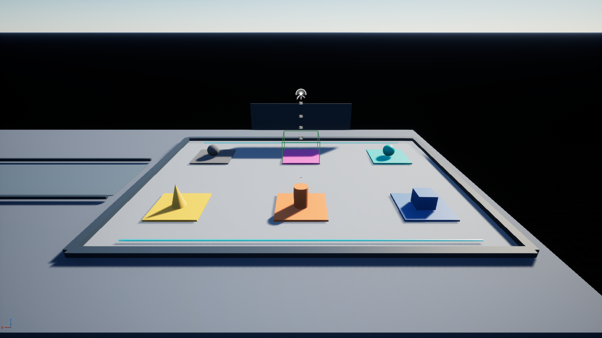

# Actor Metadata Overlay Sample

This repository contains the public sample project and demo fixtures for [Actor Metadata Overlay](https://github.com/metyatech/EditorActorTagDisplayPlugin).
The overview map is a finished technical showcase: it introduces the product in one view, then gives each supported metadata source a dedicated fixture station and a distance-filter lane.
The paid Actor Metadata Overlay plugin is not included.

## What this repository contains

The project is authored with Unreal Engine 5.6 and is verified with Unreal Engine 5.6, 5.7, and 5.8. It demonstrates actor labels, Actor Tags, Gameplay Tags, folders, Data Layers, editable property tokens, distance filtering, bounding boxes, and an excluded actor in a presentation-ready map.

## What is not included

The paid plugin, Fab packages, Deep Water Station assets, third-party assets, and precompiled binaries are not part of this repository. Engine Basic Shapes are referenced by the free fixture actors.

## Requirements

- Unreal Engine 5.6, 5.7, or 5.8 installed on Windows.
- A C++ toolchain when using the repository source directly. The free fixture plugin is compiled from source.
- A purchased copy of Actor Metadata Overlay when opening the sample as a customer. The matching plugin folder must be copied into `Plugins/EditorActorTagDisplay/` before opening the project.

## Quick setup

For local development, clone this repository beside the plugin repository and run:

```powershell
.\Scripts\Setup-Local.ps1 `
  -PluginSource '..\EditorActorTagDisplayPlugin' `
  -EngineVersion 5.6 `
  -Build
```

The script creates a fresh ignored local plugin copy, aligns only the copied descriptor to the selected engine, removes stale generated binaries when `-Build` is used, and does not modify the source plugin repository. Rerun the command whenever you switch engine versions.

See [SETUP.md](SETUP.md) for local source and Fab customer workflows.

## Open the overview map

Open `ActorMetadataSample.uproject`, then open:

```text
/Game/ActorMetadataOverlayDemo/Maps/ActorMetadataOverlayOverview
```

The Unreal project name is `ActorMetadataSample` (19 characters); the public repository name and URLs remain `ActorMetadataOverlaySample`. The overview map contains one editor-only World Partition `ALocationVolume` named `AMO_DemoRegion`. The Fixture Editor module loads that region each time the exact overview map opens, including same-session reopenings, so the seven fixture actors are available through the normal editor actor iterator without a startup Python script.

The initial display mode is the product default, `Selected Actors`. The sample contains no startup script that changes it.



The overview map is a bright, neutral outdoor test lane made only from Unreal Engine standard actors and Basic Shapes. It is intended to be used directly in `Lit` view: a floor, movable sun, captured-scene sky light, and sky atmosphere keep the fixture silhouettes readable, while the point fixtures use distinct shapes. `AMO_DemoRegion` still loads the World Partition demo area, but the editor-only region wireframe is temporarily hidden in the normal viewport. This visual environment is sample-only and is never synchronized to the Capture Host or the paid plugin.

The map is organized as a central showcase plaza with seven stations: Loot, Spawn, Quest, Navigation, Zone, Filtered, and Distance. A separate lane marks `50 m` reference, `100 m` default draw distance, and `200 m` far-actor behavior. The sample owns one material master and thirteen material instances under `Content/ActorMetadataOverlayDemo/Visuals/Materials`; the materials use no textures or external assets.

## Try Selected / All / Off

Use the viewport Show menu to switch between `Selected Actors`, `All Matching Actors`, and `Off`. Keep Game View off to see editor overlays. Game View, PIE, and SIE are expected to hide the editor-only overlay.

## Feature stations

- `Loot Crate A` shows Actor Tags, Gameplay Tags, folder, two Data Layers, State, and Priority.
- `Audio Zone — Courtyard` is a Zone Actor with a visible editor bounding box and a Radius property.
- `Far Distance Actor` is outside the default global draw distance.
- `Filtered Debug Actor` has `OverlayHidden` and is rejected by the point rule.
- The remaining point actors provide spawn, quest, and navigation examples.

## Gameplay Tags example

The free fixture actors implement `IGameplayTagAssetInterface`. The tag list is in `Config/Tags/ActorMetadataOverlaySampleTags.ini`; the semantic source of truth is [Demo/demo-spec.json](Demo/demo-spec.json).

## Property token example

The project rules use `{Property:State}`, `{Property:Priority}`, and `{Property:Radius}`. These are public, editable properties on the fixture actors and do not depend on the paid plugin.

## Distance and bounds example

The point rule uses the product's global distance limit. The zone rule enables bounding boxes, and the editor preference keeps box drawing enabled by default. Change those settings to compare the results.

## Troubleshooting

- If the project reports a missing plugin, copy the matching paid `EditorActorTagDisplay` folder into `Plugins/EditorActorTagDisplay/` before opening it.
- If C++ modules are missing, install the C++ workload and rebuild the editor target with the selected engine version.
- If the map needs to be regenerated, run `Scripts/Build-DemoMap.py` explicitly from an unattended Unreal Editor command line. It is not a startup script.

## Development verification

Run the repository checks from the sample root after selecting an engine version:

```powershell
.\Scripts\Verify-Sample.ps1 -EngineVersion 5.6 -OutputPath .verification\verify-5.6.json
```

`Build-DemoMap.py` is an explicit authoring command for regenerating the canonical map. `Setup-Local.ps1` copies and builds a local plugin instance without changing the source plugin repository. Presentation actors and sample materials are deliberately excluded from Capture Host synchronization.

## Supported engine versions

The map is authored with Unreal Engine 5.6. The fixture source and the sample are verified with Unreal Engine 5.6, 5.7, and 5.8.

## License

The sample project and `ActorMetadataOverlayDemoFixtures` plugin are MIT licensed. The paid Actor Metadata Overlay plugin has its own license and is not covered by this repository's MIT license.

## Related links

- Plugin repository: https://github.com/metyatech/EditorActorTagDisplayPlugin
- Public sample repository: https://github.com/metyatech/ActorMetadataOverlaySample
- Future Fab listing URL: to be added after the listing is published.
